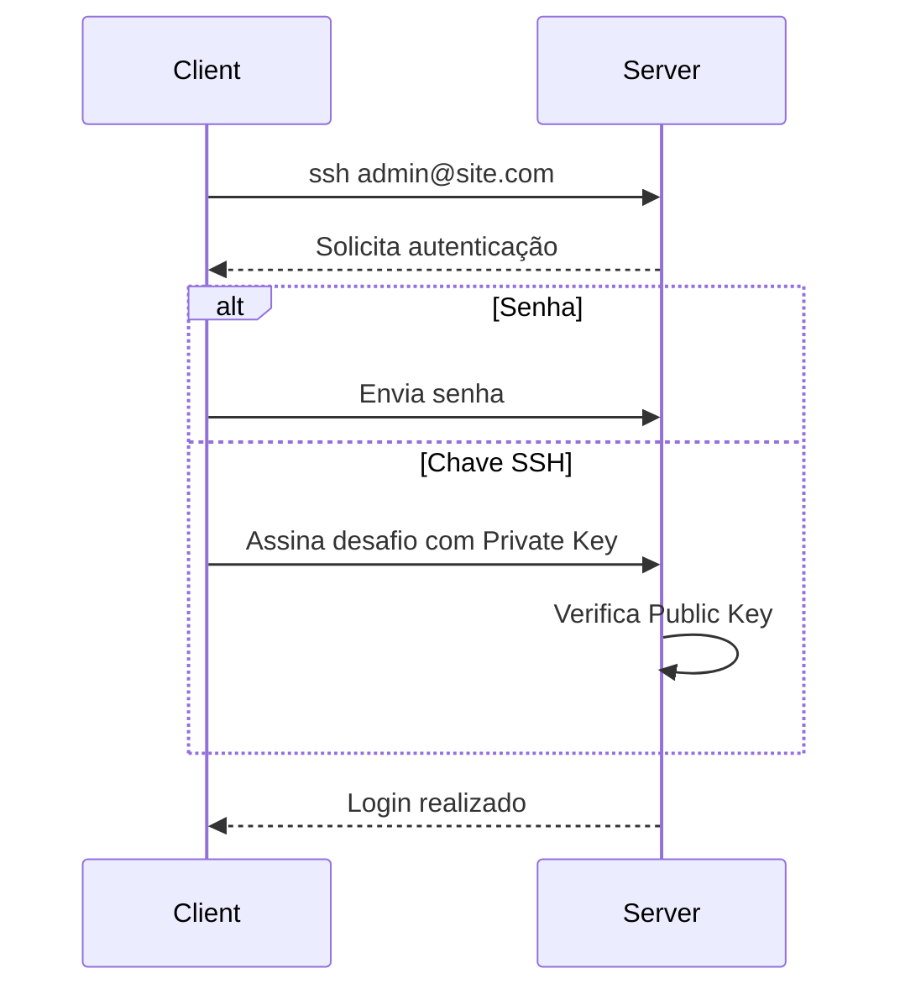
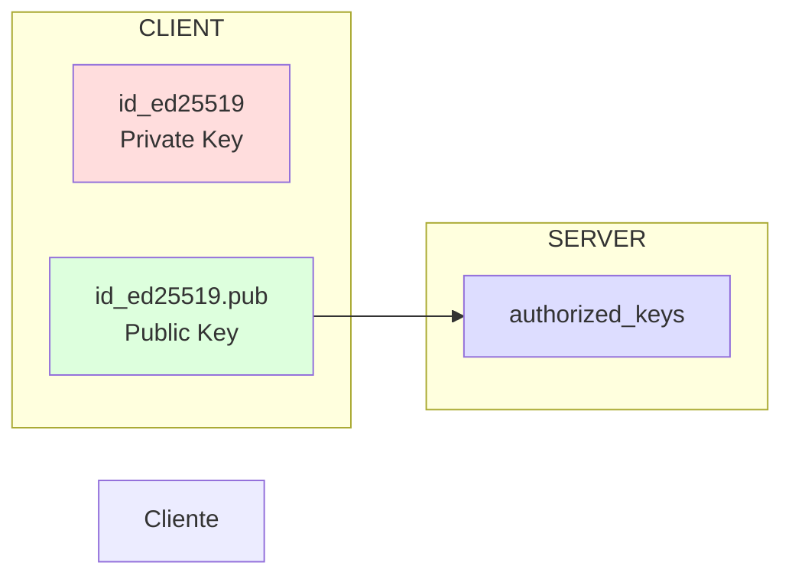
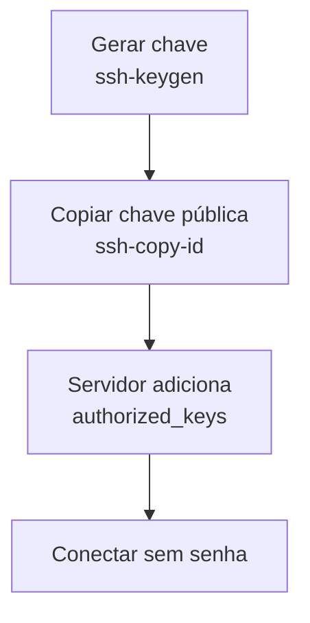
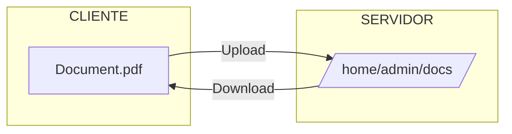
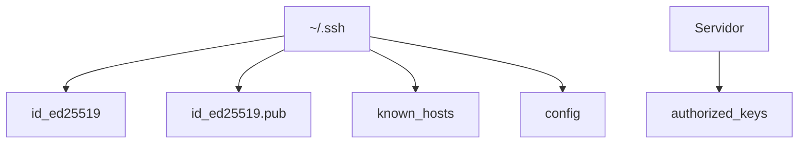
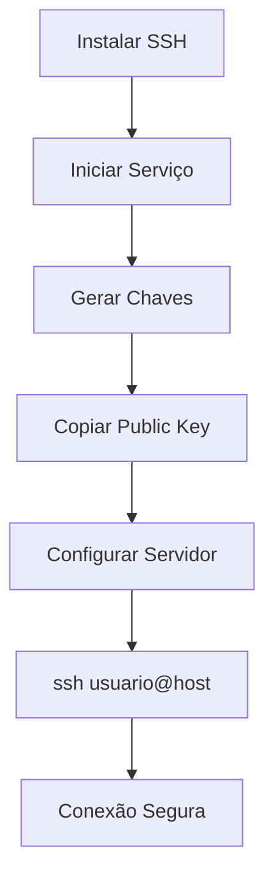
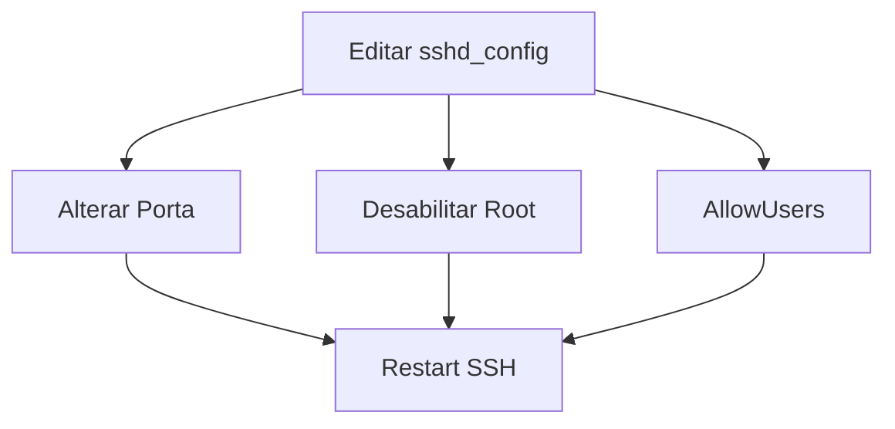
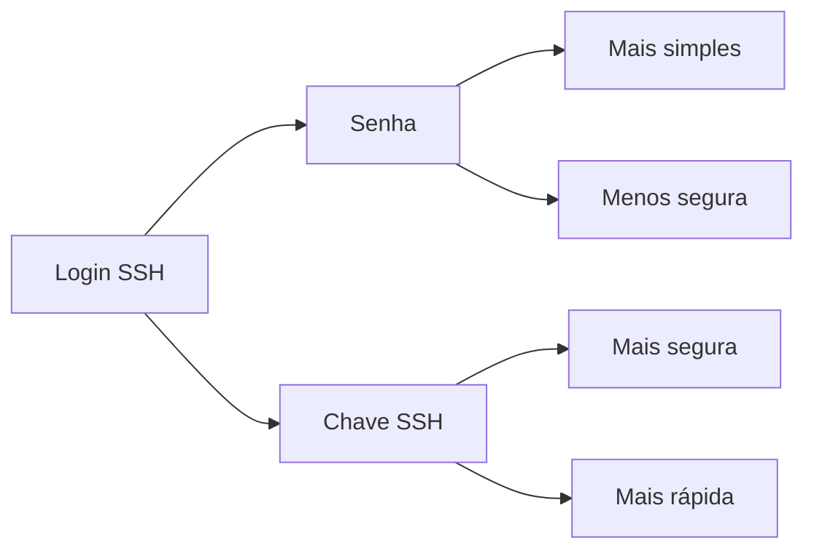

# Fluxo de conexão SSH


## Fluxo de conexão




Resultado:

```text
Cliente  --->  Servidor
      Autenticação
      Senha ou Chave
```

---

# Funcionamento das chaves SSH




Fica bem intuitivo:

```
Private Key
      │
      │ Nunca sai do cliente
      │
Public Key ─────────────► authorized_keys
```

---

# Processo do ssh-copy-id




---

# Fluxo do SCP



---

# Estrutura dos arquivos



---

# Processo completo de login



---

# Configuração do SSH



---

## Comparação entre autenticação por senha e por chave



---

## Organização que eu usaria

```text
SSH
│
├── 📦 Instalação
│      ├── apt install
│      ├── systemctl
│      └── enable
│
├── 🔐 Conexão
│      ├── Sintaxe
│      ├── Exemplos
│      └── Fluxograma Mermaid
│
├── 🔑 SSH Keys
│      ├── ssh-keygen
│      ├── Estrutura
│      ├── Mermaid
│      └── ssh-copy-id
│
├── 📂 SCP
│      ├── Upload
│      ├── Download
│      ├── Flags
│      └── Mermaid
│
├── ⚙️ Configuração
│      ├── sshd_config
│      ├── Root Login
│      ├── Porta
│      ├── AllowUsers
│      └── Mermaid
│
└── 📖 Referência
       ├── ~/.ssh
       ├── authorized_keys
       ├── known_hosts
       └── config
