# Pivoting - Guia de Conceitos e Arquitetura

## Índice
1. [O que é Pivoting](#o-que-é-pivoting)
2. [Para que Serve](#para-que-serve)
3. [Fluxo de Funcionamento](#fluxo-de-funcionamento)
4. [Camadas de Rede](#camadas-de-rede)
5. [Arquitetura TCP/IP no Pivoting](#arquitetura-tcpip-no-pivoting)
6. [Cenários e Fluxos](#cenários-e-fluxos)
7. [Modelo de Comunicação](#modelo-de-comunicação)
8. [Resumo Técnico](#resumo-técnico)

---

## O que é Pivoting

Pivoting é uma técnica que usa um sistema comprometido como trampolim para acessar redes e sistemas não diretamente acessíveis.

### Conceito Fundamental

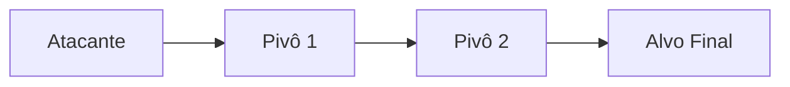

### Visão Geral

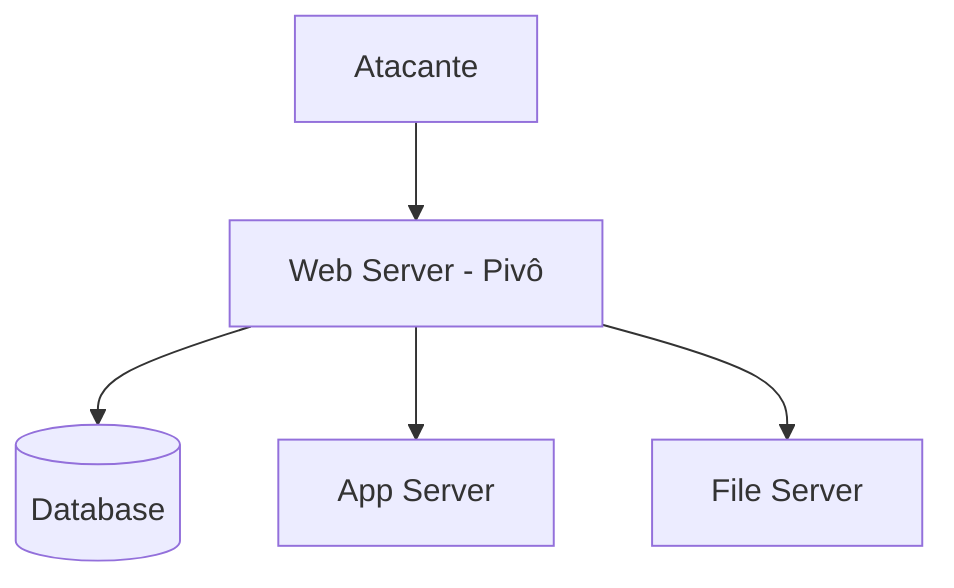

---

## Para que Serve

### Objetivos Principais

- **Amplificação de Alcance**: Acessar redes internas não roteáveis, contornar firewalls/NAT
- **Ocultação**: Mascarar origem dos ataques, manter múltiplos pontos de acesso
- **Movimento Lateral**: Explorar confiança entre sistemas, mapear topologia

### Exemplo Visual

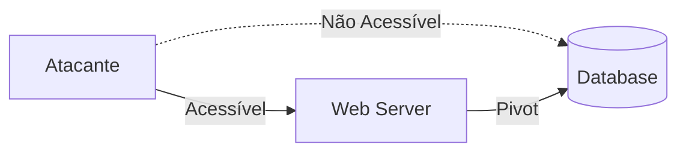

---

## Fluxo de Funcionamento

### Fluxo Geral

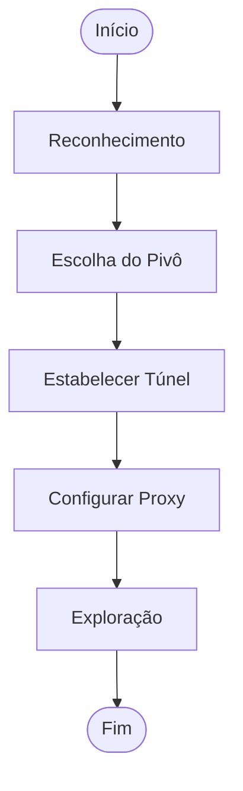

### Detalhamento do Fluxo

| Fase | Atividades |
|------|------------|
| **Reconhecimento** | Identificar rede, mapear interfaces, descobrir sistemas |
| **Escolha do Pivô** | Selecionar host, verificar encaminhamento, validar conectividade |
| **Estabelecer Túnel** | SSH (-D/-L/-R), VPN, DNS/ICMP Tunneling |
| **Configurar Proxy** | Proxychains, port forwarding, roteamento, NAT |
| **Exploração** | Scan, enumeração, exploração, movimento lateral |

### Matriz de Decisão

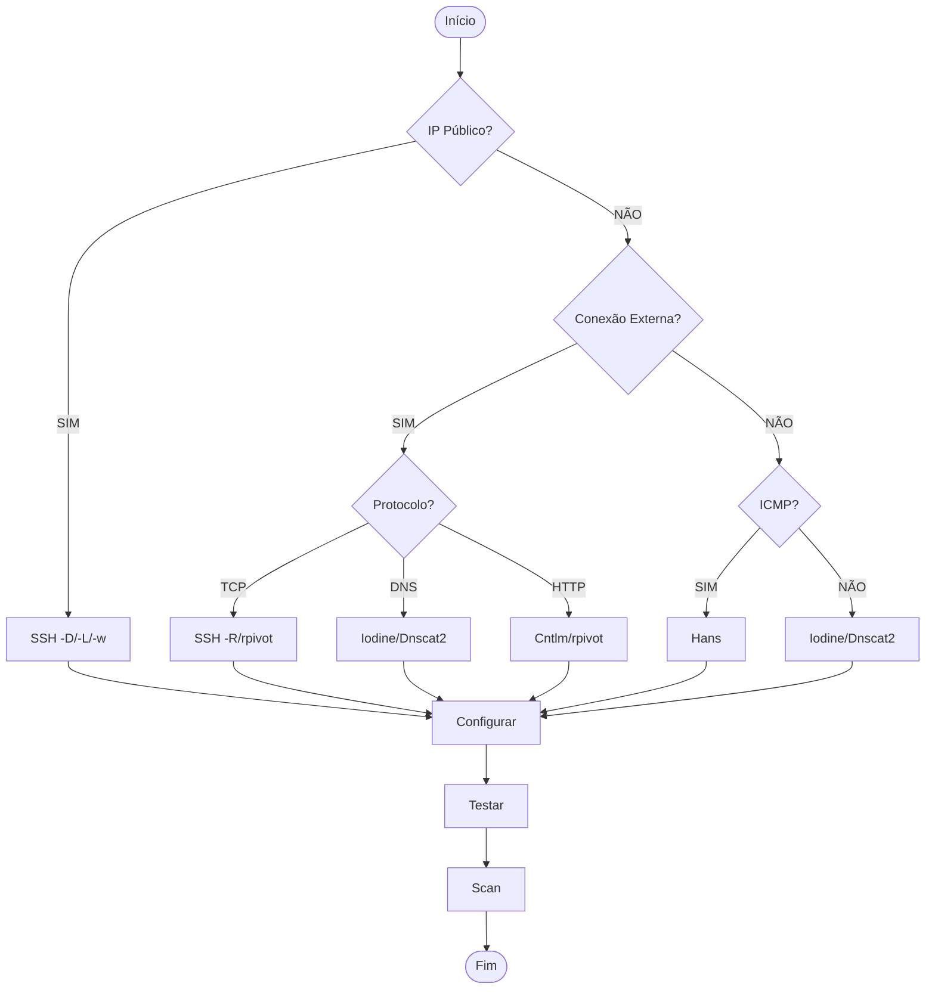

---

## Camadas de Rede

### Modelo OSI Simplificado

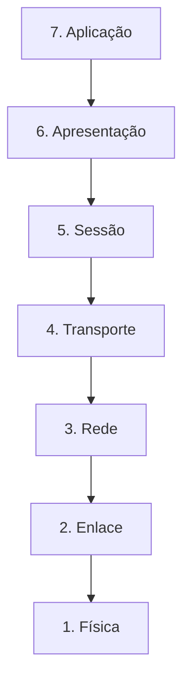

### Detalhamento por Camada

| Camada | Protocolos | Função no Pivoting |
|--------|------------|-------------------|
| **Aplicação** | HTTP, SSH, DNS, SMB, RDP | Ferramentas de enumeração e serviços alvo |
| **Apresentação** | SSL/TLS, SSH | Encapsulamento e criptografia de túneis |
| **Sessão** | SOCKS5, SSH, NetBIOS | Gerenciamento de conexões e autenticação |
| **Transporte** | TCP, UDP | Port forwarding e encaminhamento de pacotes |
| **Rede** | IP, ICMP, ARP | Roteamento e túneis de camada 3 (TUN) |
| **Enlace** | Ethernet, MAC | ARP spoofing e VLAN hopping |
| **Física** | Cabo, Fibra, WiFi | Acesso físico ao ambiente |

### Protocolos Comuns em Pivoting

| Categoria | Protocolos/Ferramentas | Características |
|-----------|----------------------|-----------------|
| **Túnel** | SSH, DNS (Iodine/Dnscat2), ICMP (Hans), OpenVPN | Transporte através de firewalls/NAT |
| **Transporte** | TCP, UDP | Conexões orientadas ou não orientadas |
| **Proxy** | SOCKS4/5, HTTP CONNECT, Cntlm | Encaminhamento de tráfego |

---

## Arquitetura TCP/IP no Pivoting

### Conexão TCP via Proxy

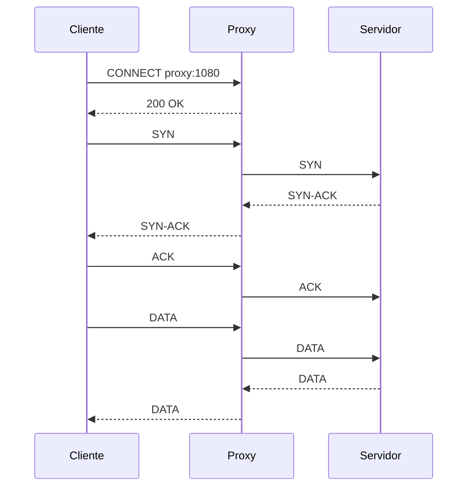

### Encapsulamento de Túnel VPN

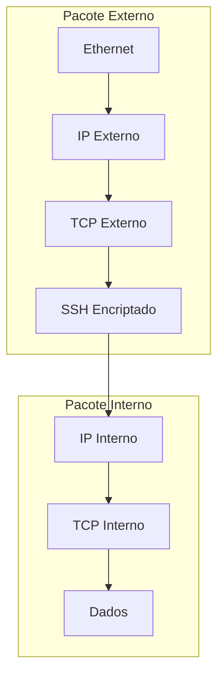

---

## Cenários e Fluxos

### 1. Alvo com IP Público

**Arquitetura:**
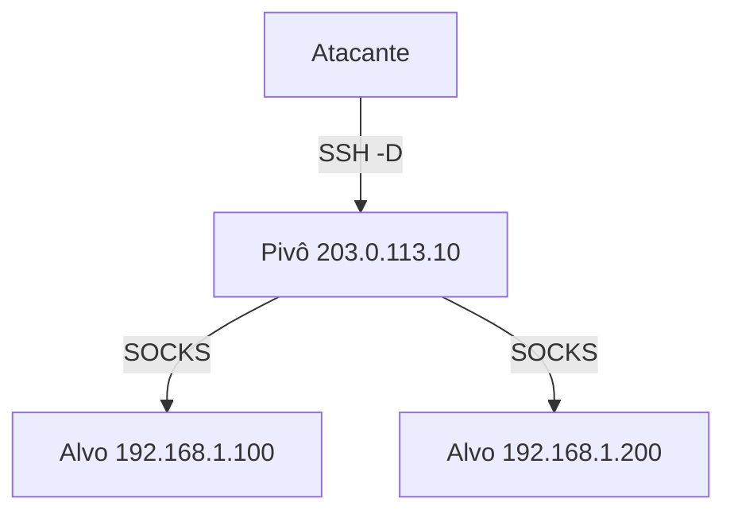

**Fluxo de Pacotes:**
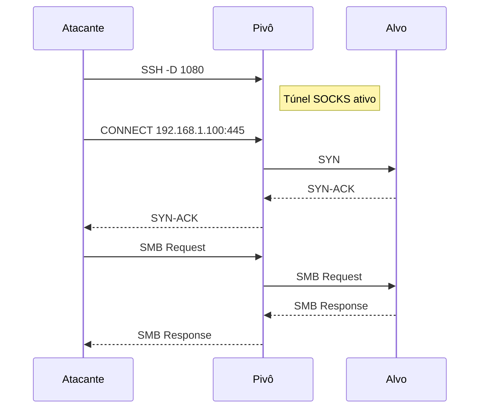

### 2. Alvo com IP Privado (NAT)

**Arquitetura:**
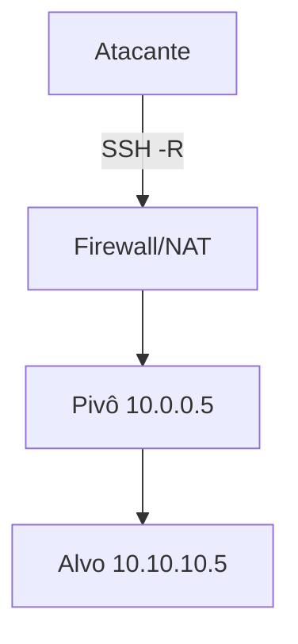

**Fluxo de Conexão Reversa:**
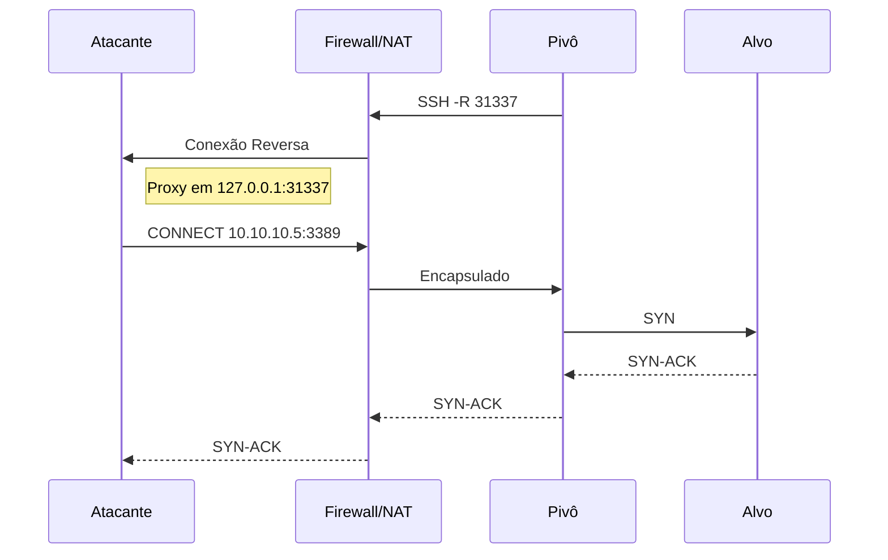

### 3. Proxy Corporativo

**Arquitetura:**
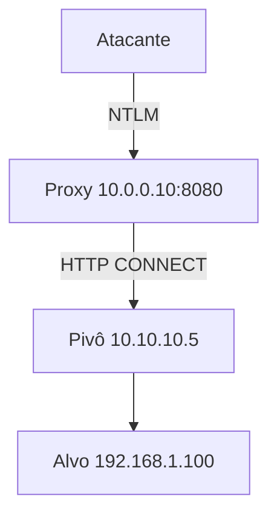

**Fluxo de Autenticação NTLM:**
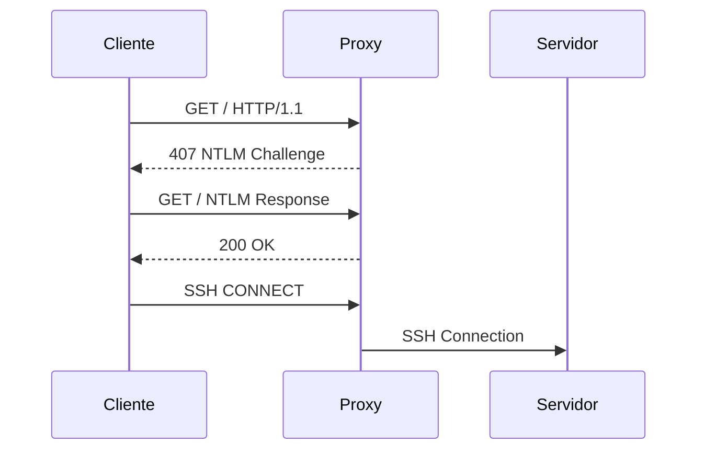

### 4. DNS Tunneling

**Arquitetura:**
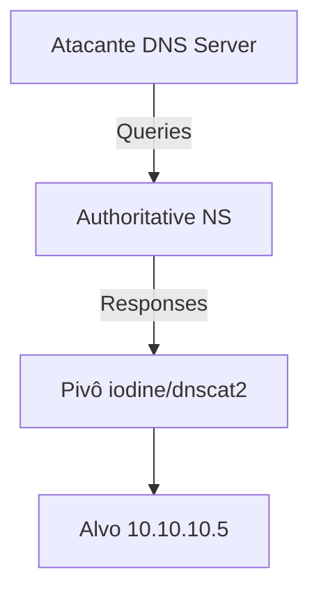

### 5. ICMP Tunneling

**Arquitetura:**
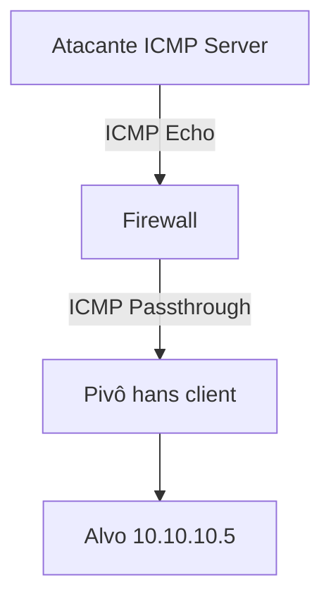

---

## Modelo de Comunicação

### Mapeamento de Portas e Protocolos

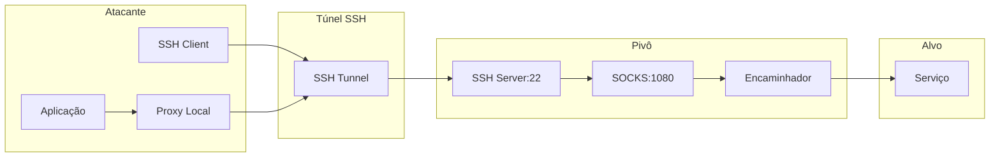

### Tipos de Tráfego

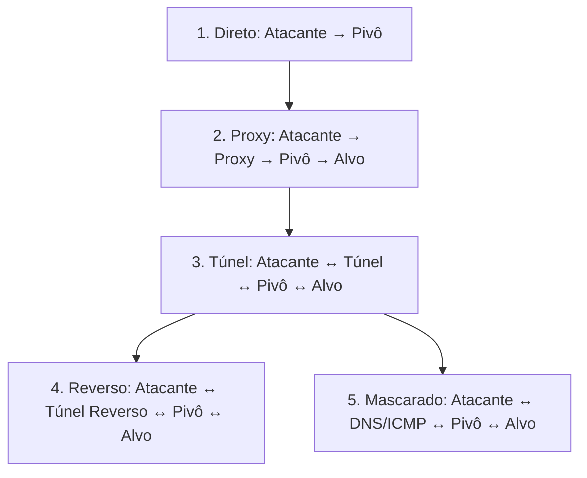

### Camadas de Abstração

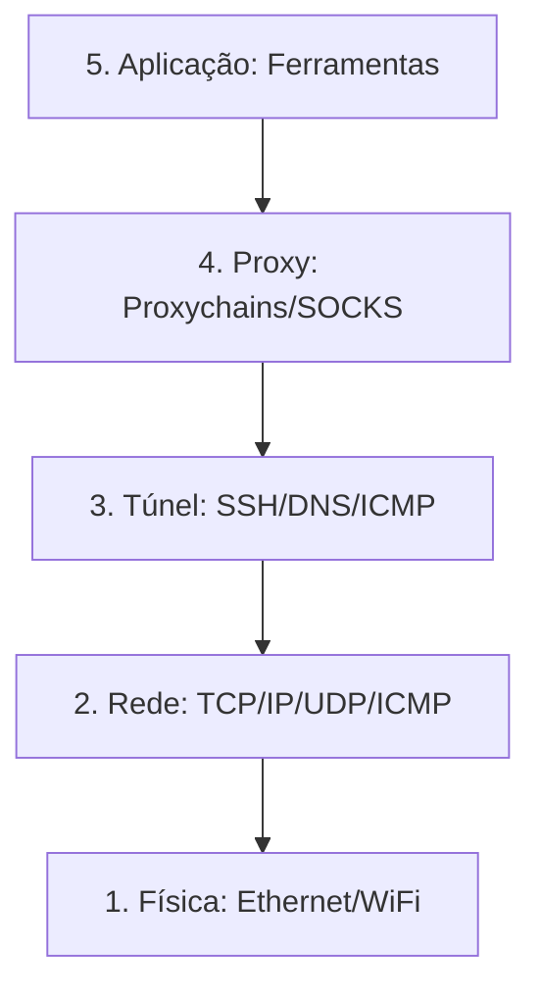

---

## Resumo Técnico

### Características por Tipo de Pivoting

| Tipo | Protocolo | Camada | Direção | Root | Velocidade |
|------|-----------|--------|---------|------|------------|
| **SSH -D** | TCP | Aplicação | Direta | Não | Alta |
| **SSH -L** | TCP | Transporte | Direta | Não | Alta |
| **SSH -R** | TCP | Transporte | Reversa | Não | Alta |
| **SSH -w** | IP | Rede | Direta | Sim | Alta |
| **SOCKS** | TCP | Sessão | Direta | Não | Alta |
| **HTTP Proxy** | TCP | Aplicação | Direta | Não | Média |
| **DNS Tunnel** | UDP | Aplicação | Reversa | Não | Baixa |
| **ICMP Tunnel** | ICMP | Rede | Reversa | Sim | Média |
| **OpenVPN** | TCP/UDP | Rede | Direta | Sim | Alta |
| **Cntlm** | TCP | Aplicação | Direta | Não | Alta |

### Visão Geral de Velocidade vs. Estabilidade

| Tipo | Velocidade | Estabilidade | Uso Típico |
|------|------------|--------------|------------|
| **SSH -D/L/R/w** | Alta | Alta | Acesso SSH direto ou reverso |
| **SOCKS/HTTP** | Média-Alta | Média-Alta | Ambientes com proxies corporativos |
| **DNS/ICMP** | Baixa-Média | Média | Firewall restritivo (apenas DNS/ICMP) |
| **OpenVPN** | Alta | Alta | Tunelamento de camada 3 |

### Pontos de Verificação

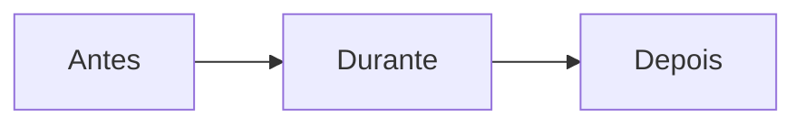

| Fase | Itens |
|------|-------|
| **Antes** | Mapear topologia, identificar firewall, testar conectividade, avaliar privilégios |
| **Durante** | Escolher técnica, criar canal, configurar ferramentas, validar roteamento |
| **Depois** | Automatizar, ocultar tráfego, expandir pivô, documentar |

### Comandos Rápidos por Cenário

| Cenário | Comando |
|---------|---------|
| **IP Público (SOCKS)** | `ssh user@host -D 1080` |
| **IP Público (Port Forward)** | `ssh user@host -L 445:192.168.1.1:445` |
| **NAT (Reverse)** | `ssh user@server -R 31337:127.0.0.1:31337` |
| **NAT (rpivot)** | `python client.py --server-ip IP --server-port 9999` |
| **Proxy NTLM (rpivot)** | `python client.py --ntlm-proxy-ip IP --username User` |
| **Proxy NTLM (Cntlm)** | `./cntlm -c config.conf` |
| **DNS Tunnel** | `iodine -f -P pass tunnel.domain.com` |
| **ICMP Tunnel** | `./hans -f -c server_ip -p pass` |
