# Pivoting - Guia de Conceitos e Arquitetura

## Índice
1. [O que é Pivoting](#o-que-é-pivoting)
2. [Para que Serve](#para-que-serve)
3. [Fluxo de Funcionamento](#fluxo-de-funcionamento)
4. [Camadas de Rede e Protocolos](#camadas-de-rede-e-protocolos)
5. [Arquitetura TCP/IP no Pivoting](#arquitetura-tcpip-no-pivoting)
6. [Cenários e Fluxos](#cenários-e-fluxos)
7. [Modelo de Comunicação](#modelo-de-comunicação)

---

## O que é Pivoting

Pivoting é uma técnica avançada de post-exploração que permite a um atacante utilizar um sistema comprometido como trampolim para acessar outras redes e sistemas que não são diretamente acessíveis. O termo vem do basquete, onde o jogador mantém um pé fixo (sistema comprometido) enquanto gira para encontrar novas oportunidades de ataque.

### Conceito Fundamental

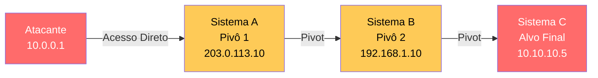
```mermaid
graph LR
    A[Atacante<br/>10.0.0.1] -->|Acesso Direto| B[Sistema A<br/>Pivô 1<br/>203.0.113.10]
    B -->|Pivot| C[Sistema B<br/>Pivô 2<br/>192.168.1.10]
    C -->|Pivot| D[Sistema C<br/>Alvo Final<br/>10.10.10.5]
    
    style A fill:#ff6b6b,color:#fff
    style B fill:#feca57,color:#000
    style C fill:#feca57,color:#000
    style D fill:#ff6b6b,color:#fff
```

### Visão Geral da Arquitetura

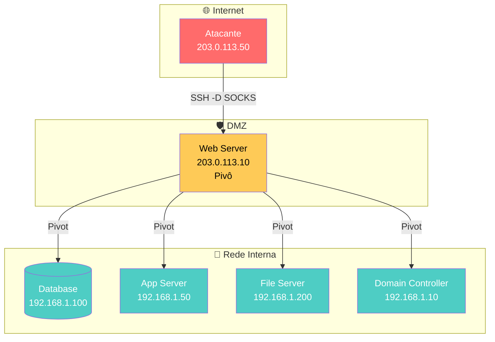
```mermaid
flowchart TB
    subgraph EXTERNO["🌐 Internet"]
        ATK[Atacante<br/>203.0.113.50]
    end
    
    subgraph DMZ["🛡️ DMZ"]
        WEB[Web Server<br/>203.0.113.10<br/>Pivô]
    end
    
    subgraph INTERNO["🏢 Rede Interna"]
        DB[(Database<br/>192.168.1.100)]
        APP[App Server<br/>192.168.1.50]
        FS[File Server<br/>192.168.1.200]
        DC[Domain Controller<br/>192.168.1.10]
    end
    
    ATK -->|SSH -D SOCKS| WEB
    WEB -->|Pivot| DB
    WEB -->|Pivot| APP
    WEB -->|Pivot| FS
    WEB -->|Pivot| DC
    
    style ATK fill:#ff6b6b,color:#fff
    style WEB fill:#feca57,color:#000
    style DB fill:#4ecdc4,color:#fff
    style APP fill:#4ecdc4,color:#fff
    style FS fill:#4ecdc4,color:#fff
    style DC fill:#4ecdc4,color:#fff
```

---

## Para que Serve

### Objetivos Principais

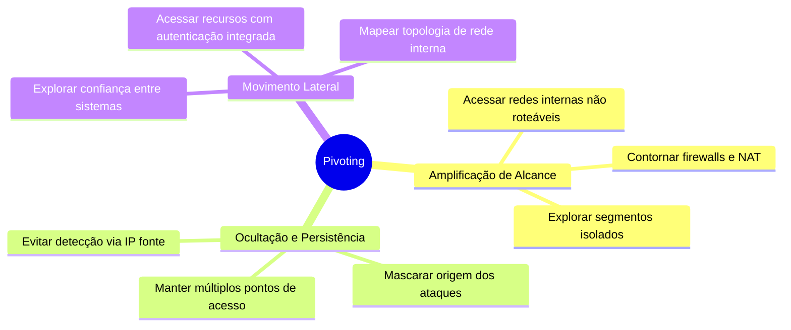
```mermaid
mindmap
  root((Pivoting))
    Amplificação de Alcance
      Acessar redes internas não roteáveis
      Contornar firewalls e NAT
      Explorar segmentos isolados
    Ocultação e Persistência
      Mascarar origem dos ataques
      Manter múltiplos pontos de acesso
      Evitar detecção via IP fonte
    Movimento Lateral
      Explorar confiança entre sistemas
      Acessar recursos com autenticação integrada
      Mapear topologia de rede interna
```

### Exemplo Visual do Objetivo

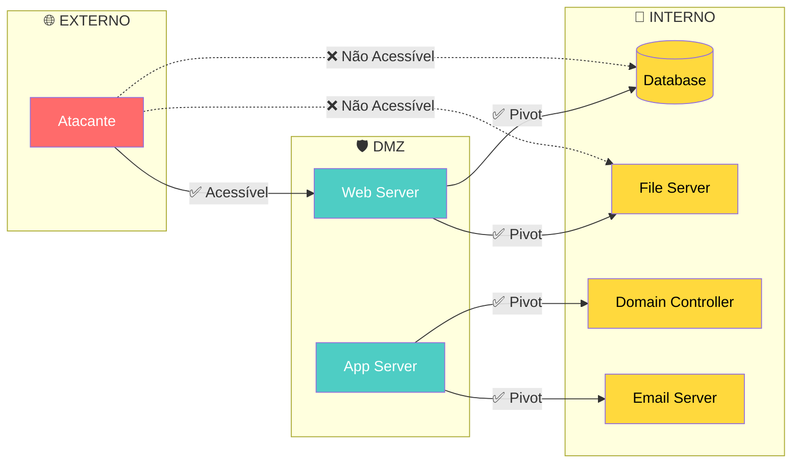
```mermaid
flowchart LR
    subgraph EXTERNO["🌐 EXTERNO"]
        ATK[Atacante]
    end
    
    subgraph DMZ["🛡️ DMZ"]
        WEB[Web Server]
        APP[App Server]
    end
    
    subgraph INTERNO["🏢 INTERNO"]
        DB[(Database)]
        FS[File Server]
        DC[Domain Controller]
        MAIL[Email Server]
    end
    
    ATK -->|✅ Acessível| WEB
    ATK -.->|❌ Não Acessível| DB
    ATK -.->|❌ Não Acessível| FS
    
    WEB -->|✅ Pivot| DB
    WEB -->|✅ Pivot| FS
    APP -->|✅ Pivot| DC
    APP -->|✅ Pivot| MAIL
    
    style ATK fill:#ff6b6b,color:#fff
    style WEB fill:#4ecdc4,color:#fff
    style APP fill:#4ecdc4,color:#fff
    style DB fill:#ffd93d,color:#000
    style FS fill:#ffd93d,color:#000
    style DC fill:#ffd93d,color:#000
    style MAIL fill:#ffd93d,color:#000
```

---

## Fluxo de Funcionamento

### Fluxo Geral de Pivoting

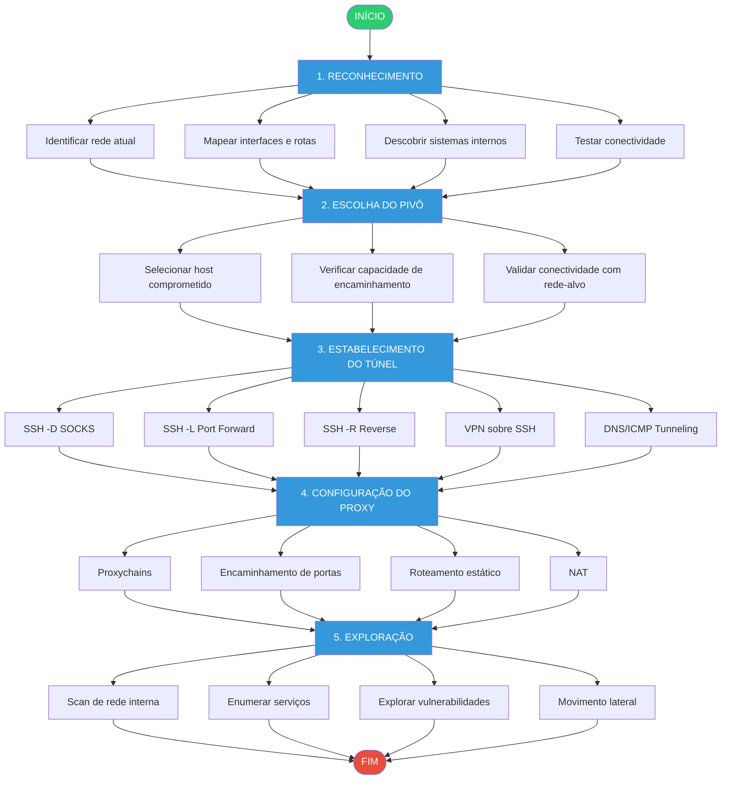
```mermaid
flowchart TD
    START([INÍCIO]) --> A[1. RECONHECIMENTO]
    
    A --> A1[Identificar rede atual]
    A --> A2[Mapear interfaces e rotas]
    A --> A3[Descobrir sistemas internos]
    A --> A4[Testar conectividade]
    
    A1 & A2 & A3 & A4 --> B[2. ESCOLHA DO PIVÔ]
    
    B --> B1[Selecionar host comprometido]
    B --> B2[Verificar capacidade de encaminhamento]
    B --> B3[Validar conectividade com rede-alvo]
    
    B1 & B2 & B3 --> C[3. ESTABELECIMENTO DO TÚNEL]
    
    C --> C1[SSH -D SOCKS]
    C --> C2[SSH -L Port Forward]
    C --> C3[SSH -R Reverse]
    C --> C4[VPN sobre SSH]
    C --> C5[DNS/ICMP Tunneling]
    
    C1 & C2 & C3 & C4 & C5 --> D[4. CONFIGURAÇÃO DO PROXY]
    
    D --> D1[Proxychains]
    D --> D2[Encaminhamento de portas]
    D --> D3[Roteamento estático]
    D --> D4[NAT]
    
    D1 & D2 & D3 & D4 --> E[5. EXPLORAÇÃO]
    
    E --> E1[Scan de rede interna]
    E --> E2[Enumerar serviços]
    E --> E3[Explorar vulnerabilidades]
    E --> E4[Movimento lateral]
    
    E1 & E2 & E3 & E4 --> F([FIM])
    
    style START fill:#2ecc71,color:#fff
    style F fill:#e74c3c,color:#fff
    style A fill:#3498db,color:#fff
    style B fill:#3498db,color:#fff
    style C fill:#3498db,color:#fff
    style D fill:#3498db,color:#fff
    style E fill:#3498db,color:#fff
```

### Fluxo de Pacotes em Pivoting

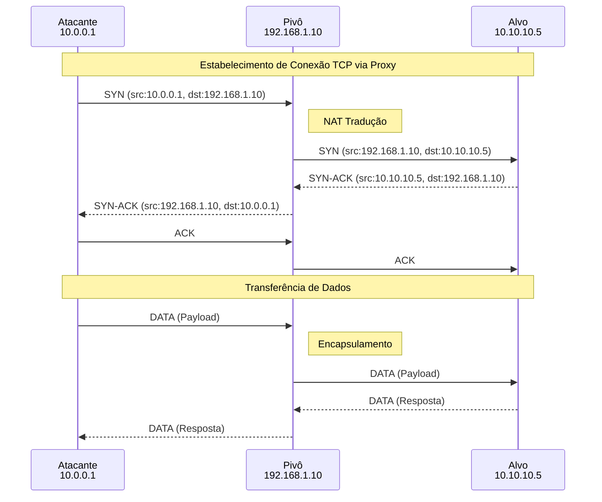
```mermaid
sequenceDiagram
    participant ATK as Atacante<br/>10.0.0.1
    participant PIVO as Pivô<br/>192.168.1.10
    participant ALVO as Alvo<br/>10.10.10.5
    
    Note over ATK,ALVO: Estabelecimento de Conexão TCP via Proxy
    
    ATK->>PIVO: SYN (src:10.0.0.1, dst:192.168.1.10)
    Note right of PIVO: NAT Tradução
    PIVO->>ALVO: SYN (src:192.168.1.10, dst:10.10.10.5)
    ALVO-->>PIVO: SYN-ACK (src:10.10.10.5, dst:192.168.1.10)
    PIVO-->>ATK: SYN-ACK (src:192.168.1.10, dst:10.0.0.1)
    ATK->>PIVO: ACK
    PIVO->>ALVO: ACK
    
    Note over ATK,ALVO: Transferência de Dados
    ATK->>PIVO: DATA (Payload)
    Note right of PIVO: Encapsulamento
    PIVO->>ALVO: DATA (Payload)
    ALVO-->>PIVO: DATA (Resposta)
    PIVO-->>ATK: DATA (Resposta)
```

### Fluxo de Decisão para Pivoting

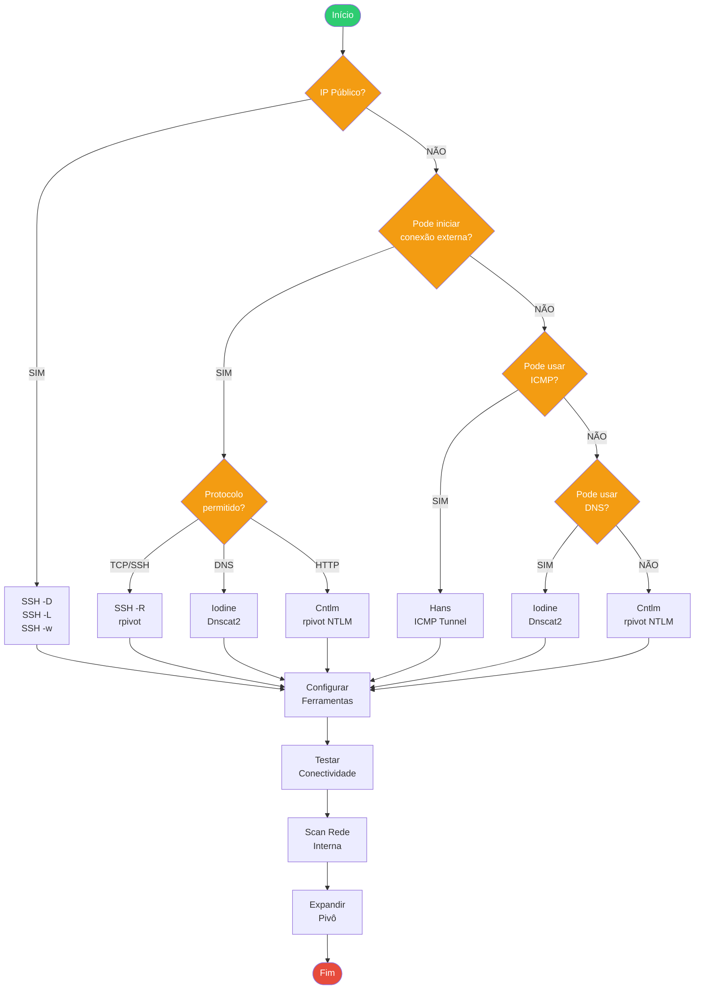
```mermaid
flowchart TD
    INICIO([Início]) --> Q1{IP Público?}
    
    Q1 -->|SIM| SSH_DIRETO[SSH -D<br/>SSH -L<br/>SSH -w]
    Q1 -->|NÃO| Q2{Pode iniciar<br/>conexão externa?}
    
    Q2 -->|SIM| Q3{Protocolo<br/>permitido?}
    Q2 -->|NÃO| Q4{Pode usar<br/>ICMP?}
    
    Q3 -->|TCP/SSH| SSH_REVERSE[SSH -R<br/>rpivot]
    Q3 -->|DNS| DNS_TUNEL[Iodine<br/>Dnscat2]
    Q3 -->|HTTP| HTTP_PROXY[Cntlm<br/>rpivot NTLM]
    
    Q4 -->|SIM| ICMP_TUNEL[Hans<br/>ICMP Tunnel]
    Q4 -->|NÃO| Q5{Pode usar<br/>DNS?}
    
    Q5 -->|SIM| DNS_TUNEL2[Iodine<br/>Dnscat2]
    Q5 -->|NÃO| HTTP_PROXY2[Cntlm<br/>rpivot NTLM]
    
    SSH_DIRETO --> CONFIG[Configurar<br/>Ferramentas]
    SSH_REVERSE --> CONFIG
    DNS_TUNEL --> CONFIG
    HTTP_PROXY --> CONFIG
    ICMP_TUNEL --> CONFIG
    DNS_TUNEL2 --> CONFIG
    HTTP_PROXY2 --> CONFIG
    
    CONFIG --> TEST[Testar<br/>Conectividade]
    TEST --> SCAN[Scan Rede<br/>Interna]
    SCAN --> EXPAND[Expandir<br/>Pivô]
    EXPAND --> FIM([Fim])
    
    style INICIO fill:#2ecc71,color:#fff
    style FIM fill:#e74c3c,color:#fff
    style Q1 fill:#f39c12,color:#fff
    style Q2 fill:#f39c12,color:#fff
    style Q3 fill:#f39c12,color:#fff
    style Q4 fill:#f39c12,color:#fff
    style Q5 fill:#f39c12,color:#fff
```

---

## Camadas de Rede e Protocolos

### Modelo OSI no Contexto de Pivoting

```mermaid
flowchart TD
    subgraph OSI["🏗️ Modelo OSI"]
        A7["7. Aplicação<br/>─────────────<br/>HTTP, SSH, DNS, SMB, RDP, FTP<br/>Ferramentas de enumeração<br/>Serviços alvo<br/>Payloads de exploração"]
        
        A6["6. Apresentação<br/>─────────────<br/>SSL/TLS, SSH (encapsulamento)<br/>Túneis criptografados<br/>Compressão de dados<br/>Mascaramento de tráfego"]
        
        A5["5. Sessão<br/>─────────────<br/>SOCKS5, SSH, NetBIOS<br/>Gerenciamento de conexões<br/>Autenticação<br/>Multiplexação de canais"]
        
        A4["4. Transporte<br/>─────────────<br/>TCP, UDP<br/>Port Forwarding<br/>Encaminhamento de pacotes<br/>Controle de fluxo"]
        
        A3["3. Rede<br/>─────────────<br/>IP, ICMP, ARP<br/>Roteamento<br/>Túneis de camada 3 (TUN)<br/>ICMP tunneling"]
        
        A2["2. Enlace<br/>─────────────<br/>Ethernet, MAC<br/>ARP spoofing<br/>MAC flooding<br/>VLAN hopping"]
        
        A1["1. Física<br/>─────────────<br/>Cabo, Fibra, WiFi, Rádio<br/>Acesso físico ao ambiente<br/>Conexões de rede"]
    end
    
    A7 --> A6 --> A5 --> A4 --> A3 --> A2 --> A1
    
    style A7 fill:#e74c3c,color:#fff
    style A6 fill:#e67e22,color:#fff
    style A5 fill:#f1c40f,color:#000
    style A4 fill:#2ecc71,color:#fff
    style A3 fill:#3498db,color:#fff
    style A2 fill:#9b59b6,color:#fff
    style A1 fill:#34495e,color:#fff
```

### Protocolos Utilizados em Pivoting

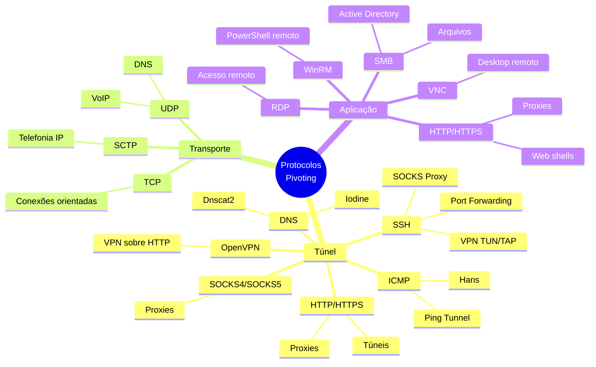
```mermaid
mindmap
  root((Protocolos<br/>Pivoting))
    Túnel
      SSH
        Port Forwarding
        SOCKS Proxy
        VPN TUN/TAP
      DNS
        Iodine
        Dnscat2
      ICMP
        Hans
        Ping Tunnel
      HTTP/HTTPS
        Proxies
        Túneis
      OpenVPN
        VPN sobre HTTP
      SOCKS4/SOCKS5
        Proxies
    Transporte
      TCP
        Conexões orientadas
      UDP
        DNS
        VoIP
      SCTP
        Telefonia IP
    Aplicação
      HTTP/HTTPS
        Web shells
        Proxies
      SMB
        Arquivos
        Active Directory
      RDP
        Acesso remoto
      WinRM
        PowerShell remoto
      VNC
        Desktop remoto
```

---

## Arquitetura TCP/IP no Pivoting

### Estabelecimento de Conexão TCP via Proxy

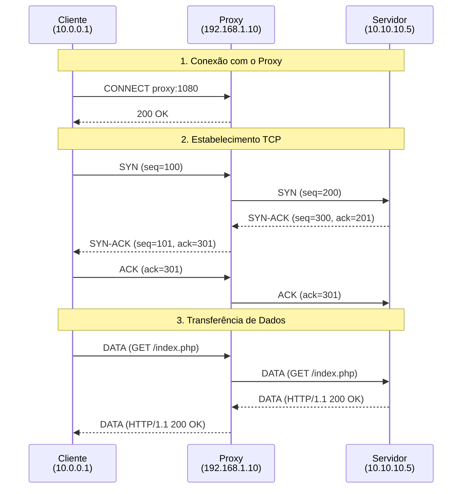
```mermaid
sequenceDiagram
    participant C as Cliente<br/>(10.0.0.1)
    participant P as Proxy<br/>(192.168.1.10)
    participant S as Servidor<br/>(10.10.10.5)
    
    Note over C,S: 1. Conexão com o Proxy
    C->>P: CONNECT proxy:1080
    P-->>C: 200 OK
    
    Note over C,S: 2. Estabelecimento TCP
    C->>P: SYN (seq=100)
    P->>S: SYN (seq=200)
    S-->>P: SYN-ACK (seq=300, ack=201)
    P-->>C: SYN-ACK (seq=101, ack=301)
    C->>P: ACK (ack=301)
    P->>S: ACK (ack=301)
    
    Note over C,S: 3. Transferência de Dados
    C->>P: DATA (GET /index.php)
    P->>S: DATA (GET /index.php)
    S-->>P: DATA (HTTP/1.1 200 OK)
    P-->>C: DATA (HTTP/1.1 200 OK)
```

### Encaminhamento de Pacotes com NAT

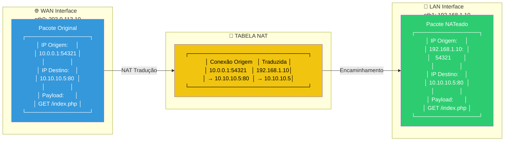
```mermaid
flowchart LR
    subgraph WAN["🌐 WAN Interface<br/>eth0: 203.0.113.10"]
        PACOTE_ORI["Pacote Original<br/>┌────────────────┐<br/>│ IP Origem:     │<br/>│ 10.0.0.1:54321 │<br/>│                │<br/>│ IP Destino:    │<br/>│ 10.10.10.5:80  │<br/>│                │<br/>│ Payload:       │<br/>│ GET /index.php │<br/>└────────────────┘"]
    end
    
    subgraph NAT["🔄 TABELA NAT"]
        TABELA["┌──────────────────────────────┐<br/>│ Conexão Origem   │ Traduzida │<br/>│ 10.0.0.1:54321   │ 192.168.1.10│<br/>│ → 10.10.10.5:80  │ → 10.10.10.5│<br/>└──────────────────────────────┘"]
    end
    
    subgraph LAN["🏢 LAN Interface<br/>eth1: 192.168.1.10"]
        PACOTE_NAT["Pacote NATeado<br/>┌────────────────┐<br/>│ IP Origem:     │<br/>│ 192.168.1.10:  │<br/>│   54321        │<br/>│                │<br/>│ IP Destino:    │<br/>│ 10.10.10.5:80  │<br/>│                │<br/>│ Payload:       │<br/>│ GET /index.php │<br/>└────────────────┘"]
    end
    
    PACOTE_ORI -->|NAT Tradução| TABELA
    TABELA -->|Encaminhamento| PACOTE_NAT
    
    style PACOTE_ORI fill:#3498db,color:#fff
    style TABELA fill:#f1c40f,color:#000
    style PACOTE_NAT fill:#2ecc71,color:#fff
```

### Encapsulamento de Túnel VPN

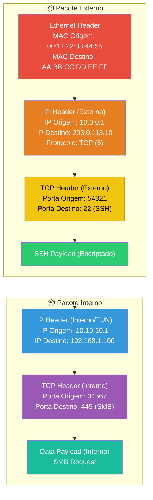
```mermaid
flowchart TD
    subgraph EXTERNO["📦 Pacote Externo"]
        ETH["Ethernet Header<br/>MAC Origem: 00:11:22:33:44:55<br/>MAC Destino: AA:BB:CC:DD:EE:FF"]
        IP["IP Header (Externo)<br/>IP Origem: 10.0.0.1<br/>IP Destino: 203.0.113.10<br/>Protocolo: TCP (6)"]
        TCP["TCP Header (Externo)<br/>Porta Origem: 54321<br/>Porta Destino: 22 (SSH)"]
        SSH["SSH Payload (Encriptado)"]
    end
    
    subgraph INTERNO["📦 Pacote Interno"]
        IP_INT["IP Header (Interno/TUN)<br/>IP Origem: 10.10.10.1<br/>IP Destino: 192.168.1.100"]
        TCP_INT["TCP Header (Interno)<br/>Porta Origem: 34567<br/>Porta Destino: 445 (SMB)"]
        DATA["Data Payload (Interno)<br/>SMB Request"]
    end
    
    SSH --> IP_INT
    IP_INT --> TCP_INT
    TCP_INT --> DATA
    
    ETH --> IP --> TCP --> SSH
    
    style ETH fill:#e74c3c,color:#fff
    style IP fill:#e67e22,color:#fff
    style TCP fill:#f1c40f,color:#000
    style SSH fill:#2ecc71,color:#fff
    style IP_INT fill:#3498db,color:#fff
    style TCP_INT fill:#9b59b6,color:#fff
    style DATA fill:#1abc9c,color:#fff
```

---

## Cenários e Fluxos

### 1. Alvo com IP Público

**Arquitetura:**
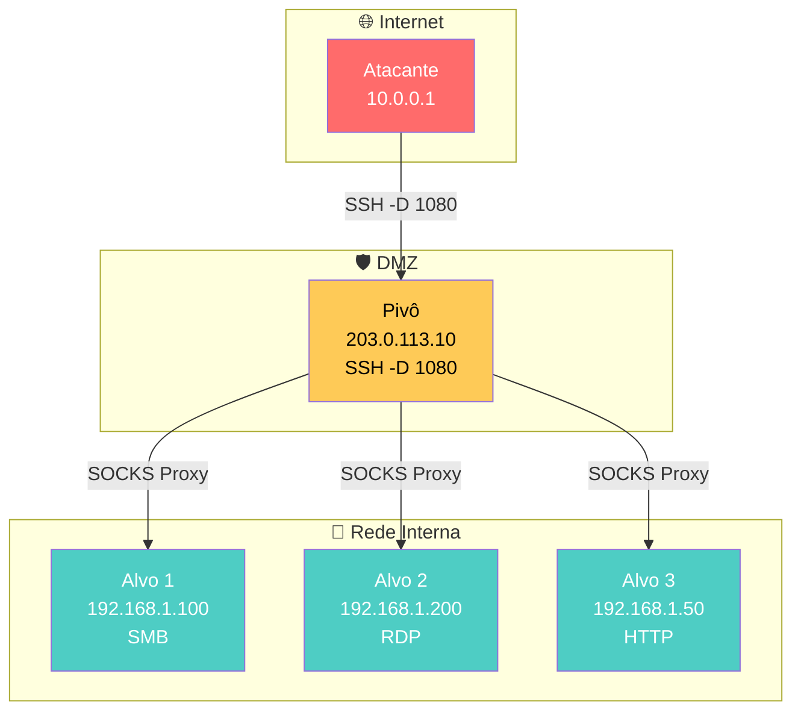
```mermaid
flowchart TB
    subgraph INTERNET["🌐 Internet"]
        ATK[Atacante<br/>10.0.0.1]
    end
    
    subgraph DMZ["🛡️ DMZ"]
        PIVO[Pivô<br/>203.0.113.10<br/>SSH -D 1080]
    end
    
    subgraph INTERNA["🏢 Rede Interna<br/>192.168.1.0/24"]
        ALVO1[Alvo 1<br/>192.168.1.100<br/>SMB]
        ALVO2[Alvo 2<br/>192.168.1.200<br/>RDP]
        ALVO3[Alvo 3<br/>192.168.1.50<br/>HTTP]
    end
    
    ATK -->|SSH -D 1080| PIVO
    PIVO -->|SOCKS Proxy| ALVO1
    PIVO -->|SOCKS Proxy| ALVO2
    PIVO -->|SOCKS Proxy| ALVO3
    
    style ATK fill:#ff6b6b,color:#fff
    style PIVO fill:#feca57,color:#000
    style ALVO1 fill:#4ecdc4,color:#fff
    style ALVO2 fill:#4ecdc4,color:#fff
    style ALVO3 fill:#4ecdc4,color:#fff
```

**Fluxo de Pacotes:**
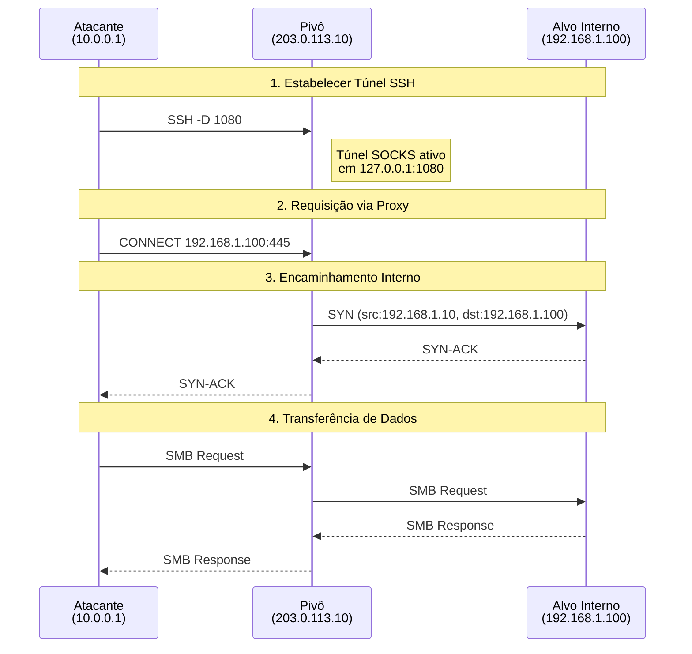
```mermaid
sequenceDiagram
    participant ATK as Atacante<br/>(10.0.0.1)
    participant PIVO as Pivô<br/>(203.0.113.10)
    participant ALVO as Alvo Interno<br/>(192.168.1.100)
    
    Note over ATK,ALVO: 1. Estabelecer Túnel SSH
    ATK->>PIVO: SSH -D 1080
    Note right of PIVO: Túnel SOCKS ativo<br/>em 127.0.0.1:1080
    
    Note over ATK,ALVO: 2. Requisição via Proxy
    ATK->>PIVO: CONNECT 192.168.1.100:445
    
    Note over ATK,ALVO: 3. Encaminhamento Interno
    PIVO->>ALVO: SYN (src:192.168.1.10, dst:192.168.1.100)
    ALVO-->>PIVO: SYN-ACK
    PIVO-->>ATK: SYN-ACK
    
    Note over ATK,ALVO: 4. Transferência de Dados
    ATK->>PIVO: SMB Request
    PIVO->>ALVO: SMB Request
    ALVO-->>PIVO: SMB Response
    PIVO-->>ATK: SMB Response
```

### 2. Alvo com IP Privado (NAT)

**Arquitetura:**
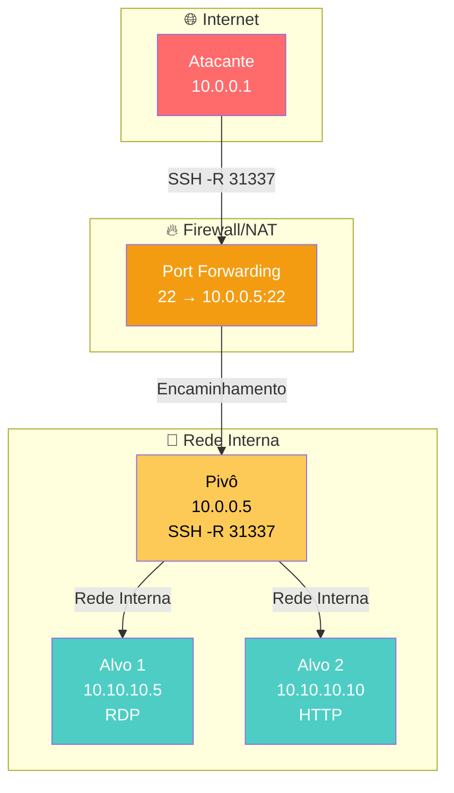
```mermaid
flowchart TB
    subgraph INTERNET["🌐 Internet"]
        ATK[Atacante<br/>10.0.0.1]
    end
    
    subgraph FIREWALL["🔥 Firewall/NAT<br/>203.0.113.10"]
        NAT[Port Forwarding<br/>22 → 10.0.0.5:22]
    end
    
    subgraph INTERNA["🏢 Rede Interna<br/>10.0.0.0/24"]
        PIVO[Pivô<br/>10.0.0.5<br/>SSH -R 31337]
        ALVO1[Alvo 1<br/>10.10.10.5<br/>RDP]
        ALVO2[Alvo 2<br/>10.10.10.10<br/>HTTP]
    end
    
    ATK -->|SSH -R 31337| NAT
    NAT -->|Encaminhamento| PIVO
    PIVO -->|Rede Interna| ALVO1
    PIVO -->|Rede Interna| ALVO2
    
    style ATK fill:#ff6b6b,color:#fff
    style NAT fill:#f39c12,color:#fff
    style PIVO fill:#feca57,color:#000
    style ALVO1 fill:#4ecdc4,color:#fff
    style ALVO2 fill:#4ecdc4,color:#fff
```

**Fluxo de Conexão Reversa:**
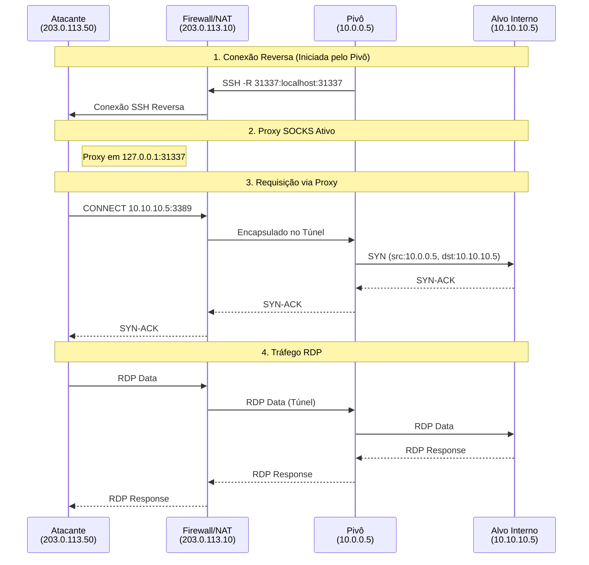
```mermaid
sequenceDiagram
    participant ATK as Atacante<br/>(203.0.113.50)
    participant NAT as Firewall/NAT<br/>(203.0.113.10)
    participant PIVO as Pivô<br/>(10.0.0.5)
    participant ALVO as Alvo Interno<br/>(10.10.10.5)
    
    Note over ATK,ALVO: 1. Conexão Reversa (Iniciada pelo Pivô)
    PIVO->>NAT: SSH -R 31337:localhost:31337
    NAT->>ATK: Conexão SSH Reversa
    
    Note over ATK,ALVO: 2. Proxy SOCKS Ativo
    Note right of ATK: Proxy em 127.0.0.1:31337
    
    Note over ATK,ALVO: 3. Requisição via Proxy
    ATK->>NAT: CONNECT 10.10.10.5:3389
    NAT->>PIVO: Encapsulado no Túnel
    PIVO->>ALVO: SYN (src:10.0.0.5, dst:10.10.10.5)
    ALVO-->>PIVO: SYN-ACK
    PIVO-->>NAT: SYN-ACK
    NAT-->>ATK: SYN-ACK
    
    Note over ATK,ALVO: 4. Tráfego RDP
    ATK->>NAT: RDP Data
    NAT->>PIVO: RDP Data (Túnel)
    PIVO->>ALVO: RDP Data
    ALVO-->>PIVO: RDP Response
    PIVO-->>NAT: RDP Response
    NAT-->>ATK: RDP Response
```

### 3. Proxy Corporativo

**Arquitetura:**
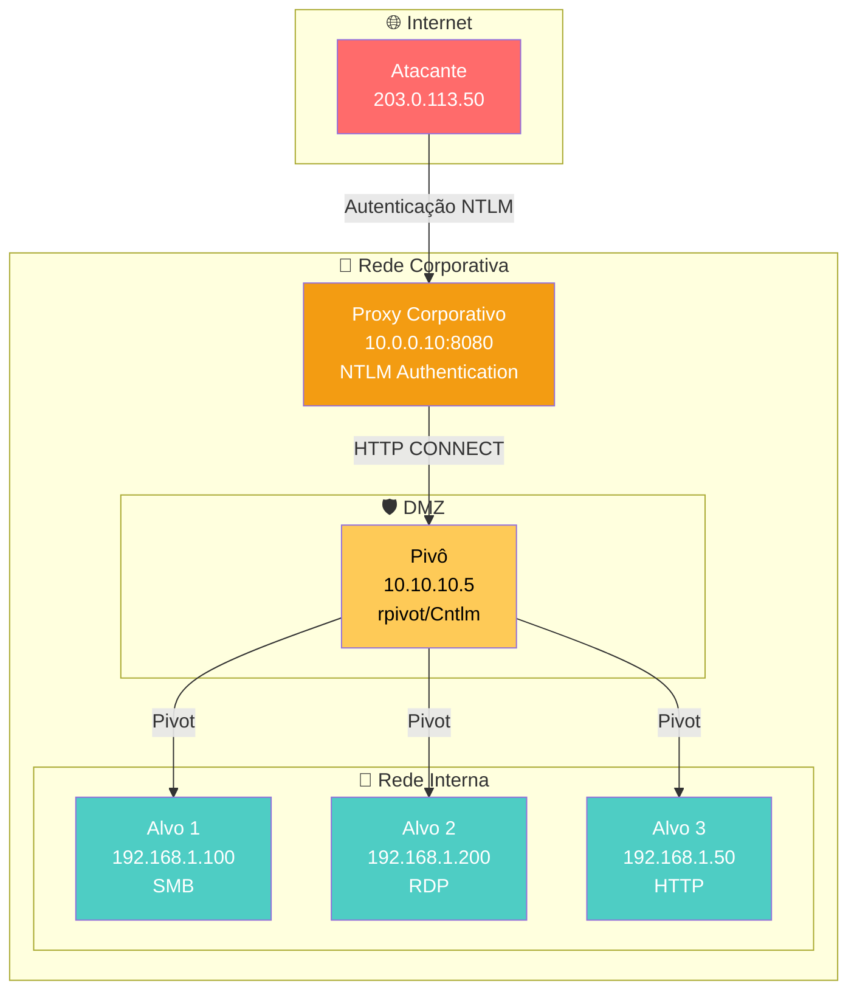
```mermaid
flowchart TB
    subgraph EXTERNO["🌐 Internet"]
        ATK[Atacante<br/>203.0.113.50]
    end
    
    subgraph CORP["🏢 Rede Corporativa"]
        PROXY[Proxy Corporativo<br/>10.0.0.10:8080<br/>NTLM Authentication]
        
        subgraph DMZ["🛡️ DMZ"]
            PIVO[Pivô<br/>10.10.10.5<br/>rpivot/Cntlm]
        end
        
        subgraph INTERNA["🏢 Rede Interna"]
            ALVO1[Alvo 1<br/>192.168.1.100<br/>SMB]
            ALVO2[Alvo 2<br/>192.168.1.200<br/>RDP]
            ALVO3[Alvo 3<br/>192.168.1.50<br/>HTTP]
        end
    end
    
    ATK -->|Autenticação NTLM| PROXY
    PROXY -->|HTTP CONNECT| PIVO
    PIVO -->|Pivot| ALVO1
    PIVO -->|Pivot| ALVO2
    PIVO -->|Pivot| ALVO3
    
    style ATK fill:#ff6b6b,color:#fff
    style PROXY fill:#f39c12,color:#fff
    style PIVO fill:#feca57,color:#000
    style ALVO1 fill:#4ecdc4,color:#fff
    style ALVO2 fill:#4ecdc4,color:#fff
    style ALVO3 fill:#4ecdc4,color:#fff
```

**Fluxo de Autenticação NTLM:**
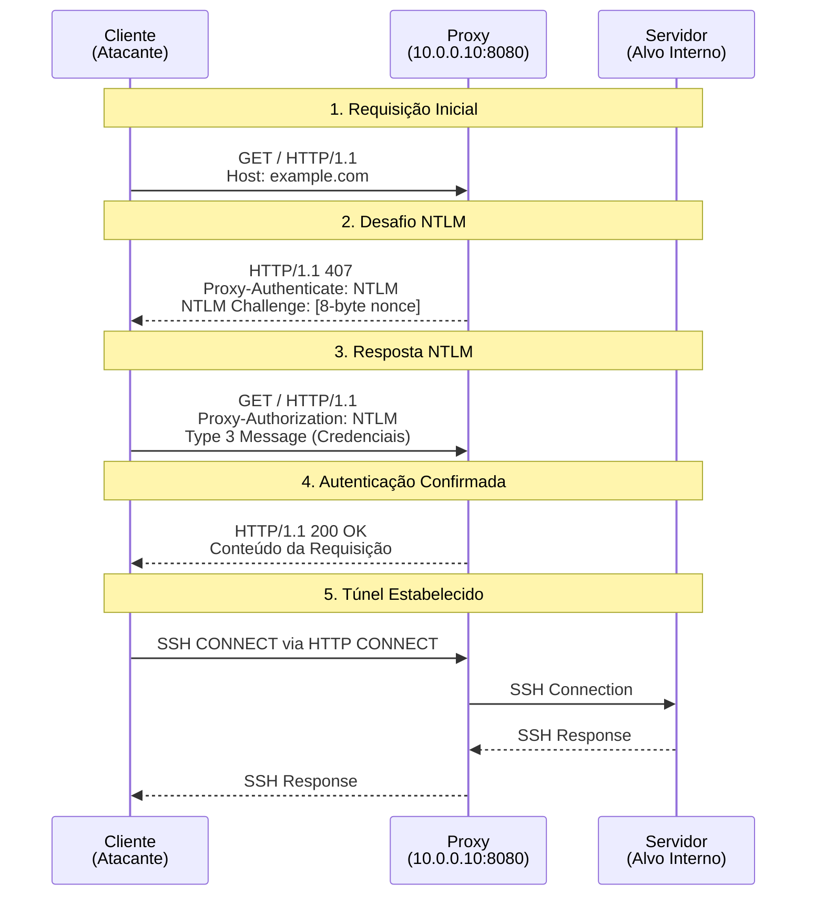
```mermaid
sequenceDiagram
    participant C as Cliente<br/>(Atacante)
    participant P as Proxy<br/>(10.0.0.10:8080)
    participant S as Servidor<br/>(Alvo Interno)
    
    Note over C,S: 1. Requisição Inicial
    C->>P: GET / HTTP/1.1<br/>Host: example.com
    
    Note over C,S: 2. Desafio NTLM
    P-->>C: HTTP/1.1 407<br/>Proxy-Authenticate: NTLM<br/>NTLM Challenge: [8-byte nonce]
    
    Note over C,S: 3. Resposta NTLM
    C->>P: GET / HTTP/1.1<br/>Proxy-Authorization: NTLM<br/>Type 3 Message (Credenciais)
    
    Note over C,S: 4. Autenticação Confirmada
    P-->>C: HTTP/1.1 200 OK<br/>Conteúdo da Requisição
    
    Note over C,S: 5. Túnel Estabelecido
    C->>P: SSH CONNECT via HTTP CONNECT
    P->>S: SSH Connection
    S-->>P: SSH Response
    P-->>C: SSH Response
```

### 4. DNS Tunneling

**Arquitetura:**
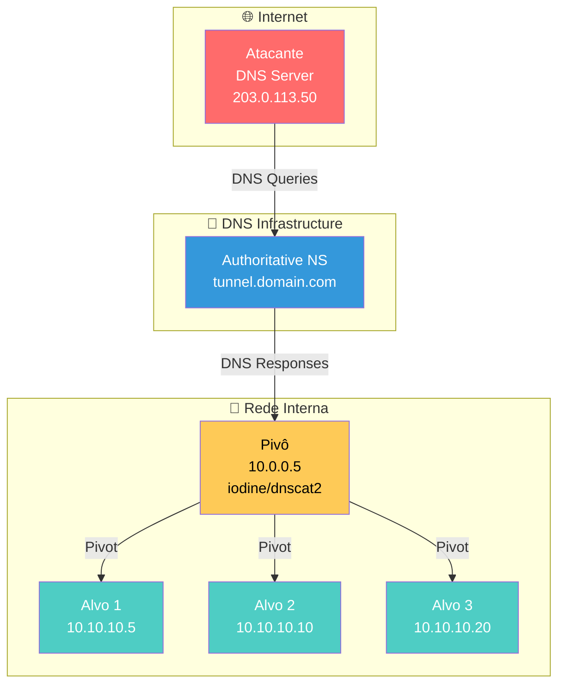
```mermaid
flowchart TB
    subgraph EXTERNO["🌐 Internet"]
        ATK[Atacante<br/>DNS Server<br/>203.0.113.50]
    end
    
    subgraph DNS["📡 DNS Infrastructure"]
        NS[Authoritative NS<br/>tunnel.domain.com]
    end
    
    subgraph INTERNA["🏢 Rede Interna"]
        PIVO[Pivô<br/>10.0.0.5<br/>iodine/dnscat2]
        ALVO1[Alvo 1<br/>10.10.10.5]
        ALVO2[Alvo 2<br/>10.10.10.10]
        ALVO3[Alvo 3<br/>10.10.10.20]
    end
    
    ATK -->|DNS Queries| NS
    NS -->|DNS Responses| PIVO
    PIVO -->|Pivot| ALVO1
    PIVO -->|Pivot| ALVO2
    PIVO -->|Pivot| ALVO3
    
    style ATK fill:#ff6b6b,color:#fff
    style NS fill:#3498db,color:#fff
    style PIVO fill:#feca57,color:#000
    style ALVO1 fill:#4ecdc4,color:#fff
    style ALVO2 fill:#4ecdc4,color:#fff
    style ALVO3 fill:#4ecdc4,color:#fff
```

**Fluxo de Pacotes DNS:**
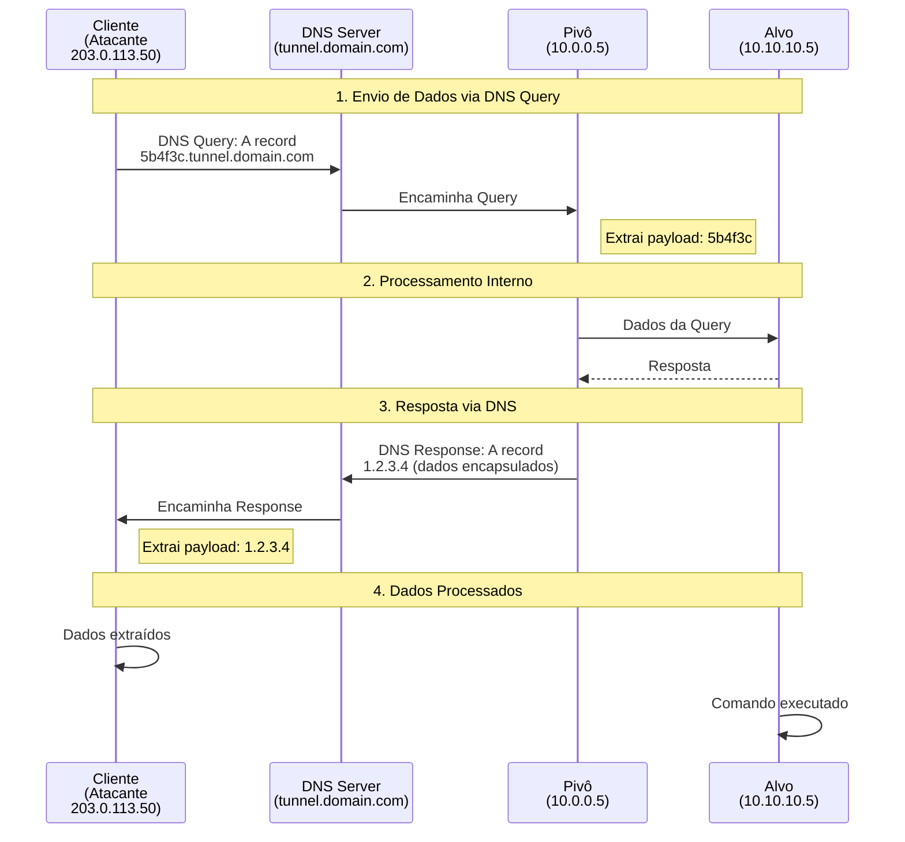
```mermaid
sequenceDiagram
    participant C as Cliente<br/>(Atacante<br/>203.0.113.50)
    participant NS as DNS Server<br/>(tunnel.domain.com)
    participant P as Pivô<br/>(10.0.0.5)
    participant A as Alvo<br/>(10.10.10.5)
    
    Note over C,A: 1. Envio de Dados via DNS Query
    C->>NS: DNS Query: A record<br/>5b4f3c.tunnel.domain.com
    NS->>P: Encaminha Query
    Note right of P: Extrai payload: 5b4f3c
    
    Note over C,A: 2. Processamento Interno
    P->>A: Dados da Query
    A-->>P: Resposta
    
    Note over C,A: 3. Resposta via DNS
    P->>NS: DNS Response: A record<br/>1.2.3.4 (dados encapsulados)
    NS->>C: Encaminha Response
    Note right of C: Extrai payload: 1.2.3.4
    
    Note over C,A: 4. Dados Processados
    C->>C: Dados extraídos
    A->>A: Comando executado
```

### 5. ICMP Tunneling

**Arquitetura:**
```mermaid
flowchart TB
    subgraph EXTERNO["🌐 Internet"]
        ATK[Atacante<br/>203.0.113.50<br/>ICMP Server]
    end
    
    subgraph FIREWALL["🔥 Firewall"]
        FW[Allow ICMP Only<br/>No TCP/UDP]
    end
    
    subgraph INTERNA["🏢 Rede Interna"]
        PIVO[Pivô<br/>10.0.0.5<br/>hans client]
        ALVO1[Alvo 1<br/>10.10.10.5]
        ALVO2[Alvo 2<br/>10.10.10.10]
        ALVO3[Alvo 3<br/>10.10.10.20]
    end
    
    ATK -->|ICMP Echo Request/Reply| FW
    FW -->|ICMP Passthrough| PIVO
    PIVO -->|Pivot| ALVO1
    PIVO -->|Pivot| ALVO2
    PIVO -->|Pivot| ALVO3
    
    style ATK fill:#ff6b6b,color:#fff
    style FW fill:#f39c12,color:#fff
    style PIVO fill:#feca57,color:#000
    style ALVO1 fill:#4ecdc4,color:#fff
    style ALVO2 fill:#4ecdc4,color:#fff
    style ALVO3 fill:#4ecdc4,color:#fff
```

**Fluxo de Pacotes ICMP:**
```mermaid
sequenceDiagram
    participant C as Atacante<br/>(203.0.113.50)
    participant FW as Firewall<br/>(ICMP Only)
    participant P as Pivô<br/>(10.0.0.5)
    participant A as Alvo<br/>(10.10.10.5)
    
    Note over C,A: 1. Envio de Dados via ICMP
    C->>FW: ICMP Echo Request<br/>Type: 8, ID: 1234, Seq: 1<br/>Data: [Payload]
    FW->>P: Encaminha ICMP
    Note right of P: Extrai payload do<br/>ICMP data
    
    Note over C,A: 2. Processamento Interno
    P->>A: Dados extraídos
    A-->>P: Resposta
    
    Note over C,A: 3. Resposta via ICMP
    P->>FW: ICMP Echo Reply<br/>Type: 0, ID: 1234, Seq: 1<br/>Data: [Resposta]
    FW->>C: Encaminha ICMP
    Note right of C: Extrai payload do<br/>ICMP data
    
    Note over C,A: 4. Dados Processados
    C->>C: Resposta extraída
    A->>A: Comando executado
```

---

## Modelo de Comunicação

### Mapeamento de Portas e Protocolos

```mermaid
flowchart LR
    subgraph ATACANTE["💻 Atacante<br/>10.0.0.1"]
        SSH_CLI[SSH Client<br/>Porta: 54321]
        APP[Aplicação<br/>nmap, curl, etc]
        PROXY[Proxy Local<br/>127.0.0.1:1080]
    end
    
    subgraph TUNEL["🔐 Túnel SSH"]
        TUNEL_SSH[SSH Tunnel<br/>Criptografado]
    end
    
    subgraph PIVO["🖥️ Pivô<br/>192.168.1.10"]
        SSH_SRV[SSH Server<br/>Porta: 22]
        SOCKS[SOCKS Proxy<br/>Porta: 1080]
        FW[Encaminhador<br/>Porta: x]
    end
    
    subgraph ALVO["🎯 Alvo<br/>10.10.10.5"]
        SERVICO[Serviço<br/>Porta: y]
    end
    
    SSH_CLI -->|SSH -D 1080| TUNEL_SSH
    TUNEL_SSH --> SSH_SRV
    SSH_SRV --> SOCKS
    APP --> PROXY
    PROXY --> TUNEL_SSH
    SOCKS --> FW
    FW --> SERVICO
    
    style ATACANTE fill:#ff6b6b,color:#fff
    style TUNEL fill:#2ecc71,color:#fff
    style PIVO fill:#feca57,color:#000
    style ALVO fill:#e74c3c,color:#fff
```

### Camadas de Abstração

```mermaid
flowchart TD
    subgraph L5["Camada 5: Aplicação"]
        FERRAMENTAS["Ferramentas: nmap, curl, smbclient, xfreerdp, ssh<br/>Função: Interação com serviços e sistemas alvo"]
    end
    
    subgraph L4["Camada 4: Proxy"]
        PROXY["Ferramentas: proxychains, SOCKS5, HTTP CONNECT<br/>Função: Encaminhamento de tráfego para o pivô"]
    end
    
    subgraph L3["Camada 3: Túnel"]
        TUNEL["Protocolos: SSH, DNS, ICMP, HTTP, OpenVPN<br/>Função: Transporte através de firewalls/NAT"]
    end
    
    subgraph L2["Camada 2: Rede"]
        REDE["Protocolos: TCP/IP, UDP, ICMP, DNS<br/>Função: Comunicação IP entre atacante e pivô"]
    end
    
    subgraph L1["Camada 1: Física/Enlace"]
        FISICA["Tecnologias: Ethernet, WiFi, Fibra, Rádio<br/>Função: Conexão física entre os hosts"]
    end
    
    L5 --> L4 --> L3 --> L2 --> L1
    
    style L5 fill:#e74c3c,color:#fff
    style L4 fill:#e67e22,color:#fff
    style L3 fill:#f1c40f,color:#000
    style L2 fill:#2ecc71,color:#fff
    style L1 fill:#3498db,color:#fff
```

### Tipos de Tráfego em Pivoting

```mermaid
flowchart TB
    subgraph T1["1. Tráfego Direto"]
        TD[Atacante → Pivô<br/>Conexão TCP/UDP direta]
    end
    
    subgraph T2["2. Tráfego Proxy"]
        TP[Atacante → Proxy → Pivô → Rede Interna → Alvo<br/>Encaminhamento de conexões]
    end
    
    subgraph T3["3. Tráfego Túnel"]
        TT[Atacante ↔ Túnel ↔ Pivô ↔ Alvo<br/>Tráfego encapsulado]
    end
    
    subgraph T4["4. Tráfego Reverso"]
        TR[Atacante ↔ Túnel Reverso ↔ Pivô ↔ Alvo<br/>Iniciado pelo pivô]
    end
    
    subgraph T5["5. Tráfego Mascarado"]
        TM[Atacante ↔ DNS/ICMP Tunnel ↔ Pivô ↔ Alvo<br/>Tráfego disfarçado]
    end
    
    T1 --> T2 --> T3
    T3 --> T4
    T3 --> T5
    
    style T1 fill:#3498db,color:#fff
    style T2 fill:#2ecc71,color:#fff
    style T3 fill:#f1c40f,color:#000
    style T4 fill:#e67e22,color:#fff
    style T5 fill:#e74c3c,color:#fff
```

### Matriz de Decisão para Pivoting

```mermaid
flowchart TD
    START([Início]) --> Q1{IP Público?}
    
    Q1 -->|SIM| SSH1[SSH -D<br/>SSH -L<br/>SSH -w]
    Q1 -->|NÃO| Q2{Pode iniciar<br/>conexão externa?}
    
    Q2 -->|SIM| Q3{Protocolo<br/>permitido?}
    Q2 -->|NÃO| Q4{Pode usar<br/>ICMP?}
    
    Q3 -->|TCP/SSH| SSH2[SSH -R<br/>rpivot]
    Q3 -->|DNS| DNS1[Iodine<br/>Dnscat2]
    Q3 -->|HTTP| HTTP1[Cntlm<br/>rpivot NTLM]
    
    Q4 -->|SIM| ICMP1[Hans<br/>ICMP Tunnel]
    Q4 -->|NÃO| Q5{Pode usar<br/>DNS?}
    
    Q5 -->|SIM| DNS2[Iodine<br/>Dnscat2]
    Q5 -->|NÃO| HTTP2[Cntlm<br/>rpivot NTLM]
    
    SSH1 --> CONFIG[Configurar<br/>Ferramentas]
    SSH2 --> CONFIG
    DNS1 --> CONFIG
    HTTP1 --> CONFIG
    ICMP1 --> CONFIG
    DNS2 --> CONFIG
    HTTP2 --> CONFIG
    
    CONFIG --> TEST[Testar<br/>Conectividade]
    TEST --> SCAN[Scan Rede<br/>Interna]
    SCAN --> EXPAND[Expandir<br/>Pivô]
    EXPAND --> END([Fim])
    
    style START fill:#2ecc71,color:#fff
    style END fill:#e74c3c,color:#fff
    style Q1 fill:#f39c12,color:#fff
    style Q2 fill:#f39c12,color:#fff
    style Q3 fill:#f39c12,color:#fff
    style Q4 fill:#f39c12,color:#fff
    style Q5 fill:#f39c12,color:#fff
```

---

## Resumo Técnico

### Características por Tipo de Pivoting

| Tipo | Protocolo | Camada | Direção | Root | Velocidade |
|------|-----------|--------|---------|------|------------|
| SSH -D | TCP | Aplicação | Direta | Não | Alta |
| SSH -L | TCP | Transporte | Direta | Não | Alta |
| SSH -R | TCP | Transporte | Reversa | Não | Alta |
| SSH -w | IP | Rede | Direta | Sim | Alta |
| SOCKS | TCP | Sessão | Direta | Não | Alta |
| HTTP Proxy | TCP | Aplicação | Direta | Não | Média |
| DNS Tunnel | UDP | Aplicação | Reversa | Não | Baixa |
| ICMP Tunnel | ICMP | Rede | Reversa | Sim | Média |
| OpenVPN | TCP/UDP | Rede | Direta | Sim | Alta |
| Cntlm | TCP | Aplicação | Direta | Não | Alta |

### Comparativo de Velocidade e Estabilidade

```mermaid
quadrantChart
    title Velocidade vs Estabilidade por Tipo de Pivoting
    x-axis Baixa Estabilidade --> Alta Estabilidade
    y-axis Baixa Velocidade --> Alta Velocidade
    quadrant-1 Ideal
    quadrant-2 Rápido mas Instável
    quadrant-3 Lento e Instável
    quadrant-4 Estável mas Lento
    SSH-D: [0.85, 0.90]
    SSH-L: [0.85, 0.88]
    SSH-R: [0.80, 0.82]
    SSH-w: [0.95, 0.95]
    SOCKS: [0.80, 0.85]
    HTTP-Proxy: [0.70, 0.65]
    DNS-Tunnel: [0.30, 0.40]
    ICMP-Tunnel: [0.50, 0.55]
    OpenVPN: [0.90, 0.92]
    Cntlm: [0.75, 0.70]
```

### Pontos de Verificação

```mermaid
flowchart LR
    subgraph PRE["🔍 Antes do Pivoting"]
        P1[Mapear topologia de rede]
        P2[Identificar restrições de firewall]
        P3[Verificar conectividade de saída]
        P4[Avaliar privilégios no sistema alvo]
    end
    
    subgraph DUR["⚡ Durante o Pivoting"]
        D1[Escolher técnica adequada]
        D2[Estabelecer canal com redundância]
        D3[Configurar ferramentas apropriadas]
        D4[Validar roteamento]
    end
    
    subgraph POS["🎯 Pós-Pivoting"]
        PO1[Automatizar reconexão]
        PO2[Ocultar tráfego]
        PO3[Expandir para outros segmentos]
        PO4[Documentar configurações]
    end
    
    PRE --> DUR --> POS
    
    style PRE fill:#3498db,color:#fff
    style DUR fill:#f1c40f,color:#000
    style POS fill:#2ecc71,color:#fff
```

---

## Diagrama Completo de Arquitetura

```mermaid
flowchart TB
    subgraph EXTERNO["🌐 Internet"]
        ATK[Atacante<br/>203.0.113.50]
    end
    
    subgraph CAMADAS["📚 Camadas de Comunicação"]
        direction LR
        APP["Aplicação<br/>HTTP/SSH/SMB"]
        SES["Sessão<br/>SOCKS/SSL"]
        TRA["Transporte<br/>TCP/UDP"]
        RED["Rede<br/>IP/ICMP"]
        FIS["Física<br/>Ethernet/WiFi"]
    end
    
    subgraph FIREWALL["🔥 Firewall/NAT"]
        FW[Security Rules<br/>Port Forwarding<br/>NAT/PAT]
    end
    
    subgraph PIVOS["🔄 Pontos de Pivoting"]
        P1[Pivô 1<br/>DMZ<br/>203.0.113.10]
        P2[Pivô 2<br/>Rede Interna<br/>192.168.1.10]
        P3[Pivô 3<br/>Rede Crítica<br/>10.10.10.5]
    end
    
    subgraph ALVOS["🎯 Alvos Finais"]
        DB[(Database<br/>10.10.10.100)]
        DC[Domain Controller<br/>10.10.10.10]
        FS[File Server<br/>10.10.10.50]
        APP2[App Server<br/>10.10.10.200]
    end
    
    ATK -->|SSH -D| P1
    ATK -->|ICMP Tunnel| FW
    FW -->|ICMP Passthrough| P1
    
    P1 -->|SSH -L| P2
    P1 -->|DNS Tunnel| P2
    P2 -->|SOCKS| P3
    
    P3 -->|Rede Interna| DB
    P3 -->|Rede Interna| DC
    P3 -->|Rede Interna| FS
    P3 -->|Rede Interna| APP2
    
    CAMADAS -.->|Suporte| ATK
    CAMADAS -.->|Suporte| P1
    CAMADAS -.->|Suporte| P2
    CAMADAS -.->|Suporte| P3
    
    style ATK fill:#ff6b6b,color:#fff
    style FW fill:#f39c12,color:#fff
    style P1 fill:#feca57,color:#000
    style P2 fill:#feca57,color:#000
    style P3 fill:#feca57,color:#000
    style DB fill:#4ecdc4,color:#fff
    style DC fill:#4ecdc4,color:#fff
    style FS fill:#4ecdc4,color:#fff
    style APP2 fill:#4ecdc4,color:#fff
    style CAMADAS fill:#95a5a6,color:#fff
```

---

**Nota:** Este guia aborda conceitos fundamentais de pivoting. A implementação prática requer conhecimento técnico detalhado e compreensão dos riscos envolvidos em cada técnica.
